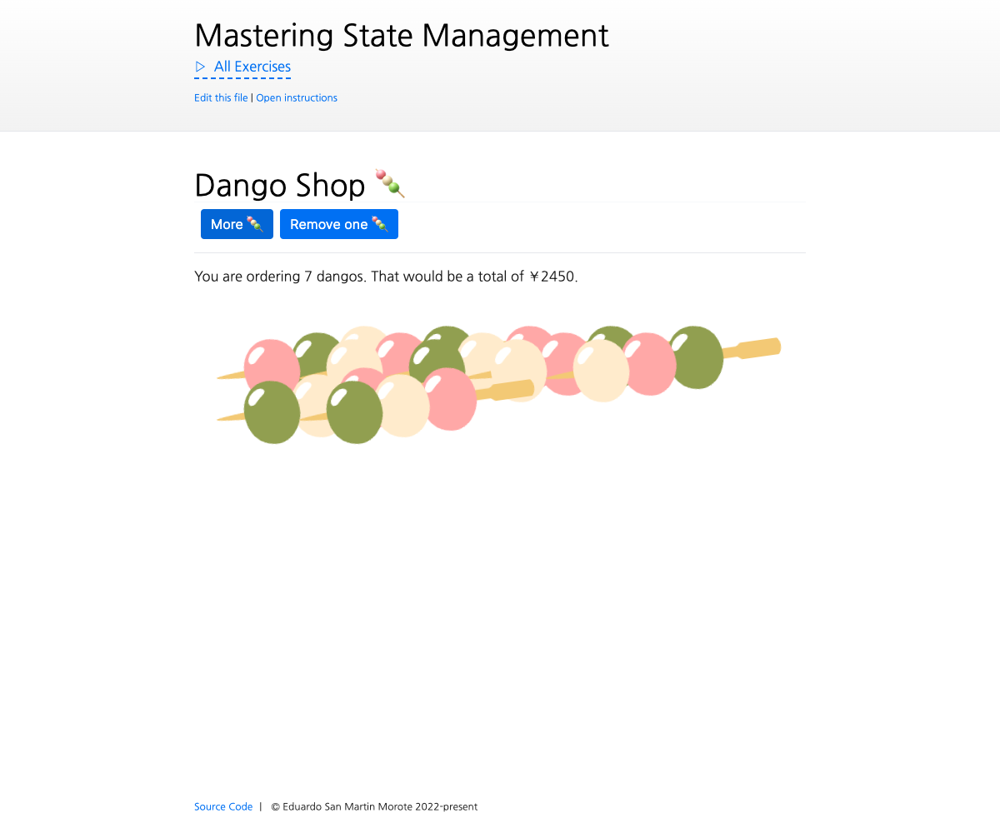

# Interacting with store state

<picture>
  <source srcset="./.internal/screenshot-dark.png" media="(prefers-color-scheme: dark)">
  
</picture>

Let's review how to add and modify store state with Pinia. In this exercise, we will limit ourselves to exploring the
`state` property of the store, without using _getters_ or _actions_.

## 📝 Your Notes

Write your notes or questions here.

## 🎯 Goals

- Create a state property `cartAmount` on the Dango Shop store
- The `cartAmount` should increment when the "More 🍡" is clicked
- The `cartAmount` should decrement when the "Remove one 🍡" is clicked
- Display as many dango as the `cartAmount` has. Note: Don't place a `v-for` directly on `<DangoStick>`, do it on the
  wrapping `
`. It won't look good otherwise 😄
- Disable the remove button if there are no dangos in the cart
- Disable the add button if there are more than 99 dangos in the cart
- Only show the reset button if there are more than 49 dangos in the cart
- Reset the `cartAmount` to 0 when the reset button is clicked
- Display the _huge order_ message only if there are more than 49 dangos in the cart
