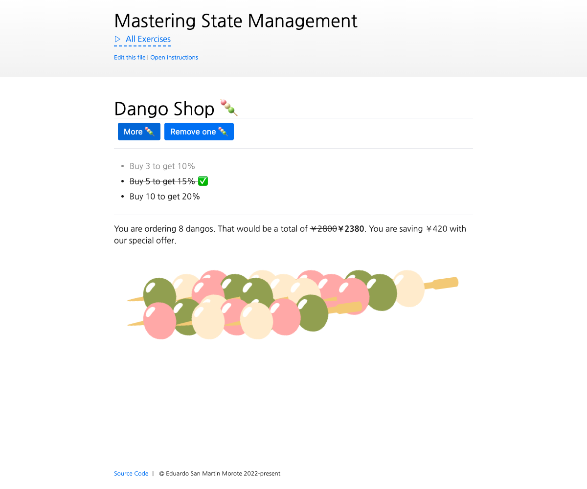

# Store getters

<picture>
  <source srcset="./.internal/screenshot-dark.png" media="(prefers-color-scheme: dark)">
  
</picture>

Let's review the different ways to add and use getters to stores with Pinia. In this exercise, we will limit ourselves
to exploring the `getters` property of the store, without using _actions_.

## 📝 Your Notes

Write your notes or questions here.

## 🎯 Goals

- Create a getter `totalPrice` on the Dango Shop store that returns the total price of the cart
- Display that total amount
- Discount calculator:
  - Create a getter to display the discounted price of the cart based on the following rules:
    - 10% discount if the cart at least 3 dangos (and less than 5)
    - 15% discount if the cart has at least 5 dangos (and less than 10)
    - 20% discount if the cart has at least 10 dangos
  - Make sure the price is rounded up with no decimal (e.g. 350.2 becomes 351)
  - Display the discounted price of the cart when there is one
  - Always display the original price of the cart, crossed out if there is a discount (you can apply the existing class
    `line-through` for that)
- Add a getter that returns how much the person saved with the discount and display it
- Ensure all the getters are correctly typed
