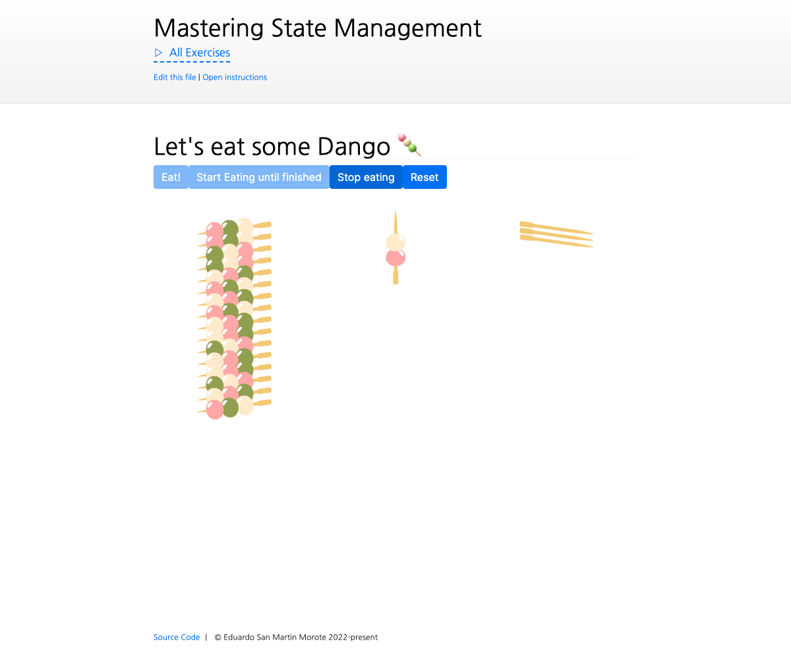

# Store getters

<picture>
  <source srcset="./.internal/screenshot-dark.png" media="(prefers-color-scheme: dark)">
  
</picture>

Let's review actions actions in Pinia. In this exercise, we will practice with actions and enjoy eating some yummy
dangos in the process!

## 📝 Your Notes

Write your notes or questions here.

## 🎯 Goals

- Create an action named `eatDango` that eats one dango ball.
  - Increment the number of `eatenBalls` by one
  - Decrement the number of sticks ( the `amount` state) every 3 balls since each dango stick has 3 balls
  - Make sure not to do anything if there are no dangos left
  - Don't reset the `eatenBalls` variable, use the module operator `%` to check if we have eaten 3 balls
- Call that action when the user clicks on the "Eat!" button
- Create an action named `startEating` that starts eating dangos until there are no dangos left
  - It should call the `eatDango` action every 500ms
- Call that action when the user clicks on the "Start eating!" button
- Modify the `startEating` action so that it can be paused
  - Add a boolean state property named `isEating`
  - Ensure `startEating` stops if `isEating` is false
- Create an action named `stopEating` that stops eating dangos
- Call that action when the user clicks on the "Stop eating!" button
