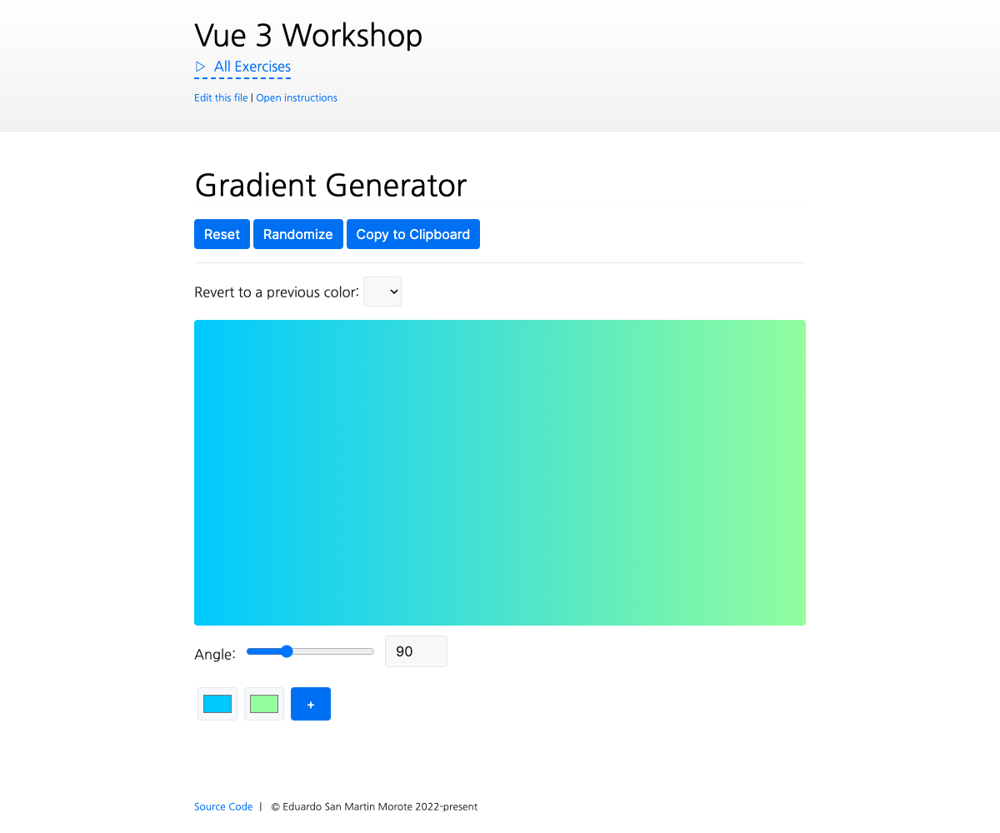

# Building a Gradient Generator

<picture>
  <source srcset="./.internal/screenshot-dark.png" media="(prefers-color-scheme: dark)">
  
</picture>

During this exercise, you will build a gradient generator. The user should be able to select different colors and see
the gradient change in real time. We will add the ability to generate random gradients. The user will be able to
visualize the CSS code for the gradient and copy it to the clipboard with the press of a button.

## 📝 Your Notes

Write your notes or questions here.

## 🎯 Goals

- Store the different colors of the gradient in an array named `colors`
- Generate the CSS gradient using the array
- Apply that gradient as a `background-image` property to the `.gradient-preview` element
- Allow changing the color using the `<input type="color">` element (a native color picker)
- Create a function that allows adding a new color to the gradient
- Allow removing colors from the gradient
  - The user should not be able to remove a color if there are only two colors left
- Add an `angle` property to the store so the user can control the angle of the gradient
- Use the angle in the generated gradient
- Display the preview of the CSS code for the gradient
- Add a button that allows the user to copy it to the clipboard

> 💡 HINT: VueUse is installed and exposes a `useClipboard()` composable

## 💪 Extra goals

_Extra goals might not have any tests and can be done later or skipped._

As an extra goal, let's add a history of all the generated gradients. Every time the user randomizes the gradient, we
save the current one into an array. Then you can display the list with a `<select>` and let the user go back to any
previous gradient.
