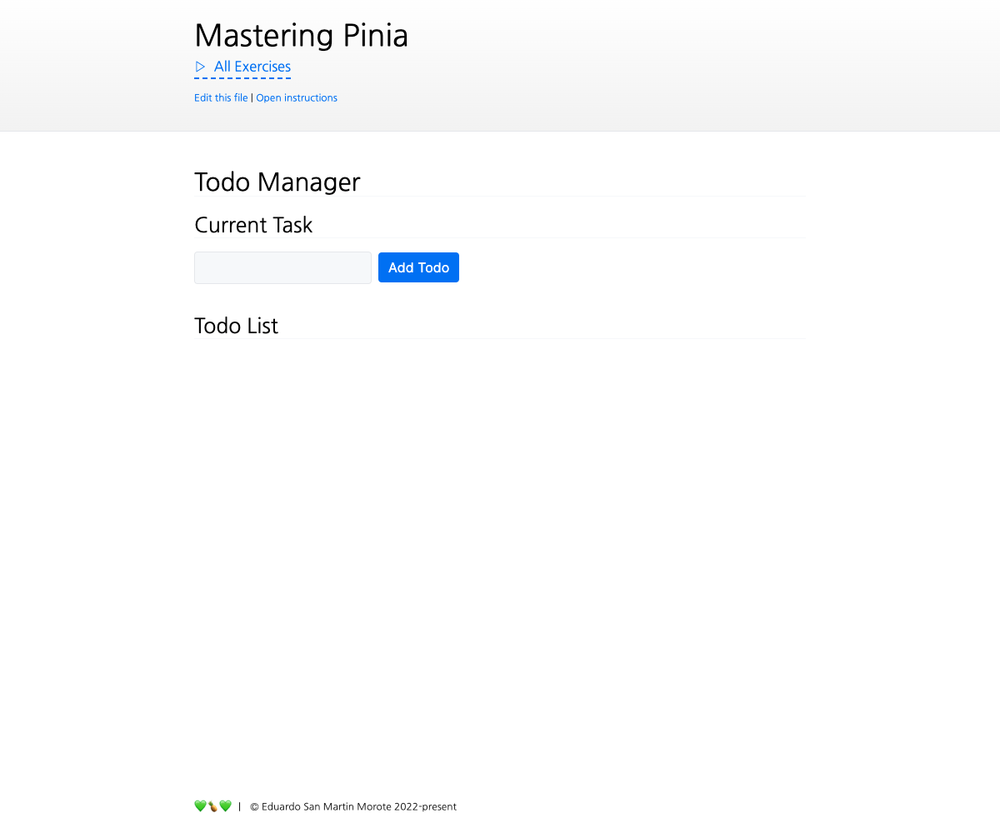

# Refactoring Stores

<picture>
  <source srcset="./.internal/screenshot-dark.png" media="(prefers-color-scheme: dark)">
  
</picture>

In this exercise we are going to refactor a large store into two smaller ones. We will also improve some of its usage within components.

## 📝 Your Notes

Write your notes or questions here.

## 🎯 Goals

Let's start by familiarizing ourselves with the codebase before refactoring it:

- Open the `stores/todos.ts` file and give it a read.
  - Notice it contains a lot of code and handles two different concerns: the todos and the active task attached to the todos
  - Take a moment to read through the code and understand what it does
- Open `stores/tasks.ts`. It's empty for now but we will fill it with parts of `stores/todos.ts`
- Open `index.vue` and check its usage of the todos store

Time to refactor:

- Start by separating the code related to the active task and the code related to the todo list within `stores/todos.ts`
- Then, move the code related to task management to `stores/tasks.ts` while leaving everything related to the todo list in `stores/todos.ts`
  
  

  
💡 Tip: <i>What do belong to Tasks?</i>

  The following properties should be removed from the todos store and moved to the tasks store:

  - `finishedTasks`
  - `activeTask`
  - `hasActiveTodo`
  - `startedTasks`
  - `startTodo`
  - `pauseCurrentTodo`
  - `finishCurrentTodo`
  - `isTodoStarted`

   

  After moving them to the tasks store, make sure to remove them from the return statement in the todos store. Following the TypeScript errors is a good way to make sure you don't forget anything.

  

  - Ensure you can read the _list_ of todos within the tasks store
  - Now that you have refactored the store, you need to refactor its usage:
    - Fix the `index.vue` component to use the new stores
    - Fix the `components/TodoItem.vue` component to use the new stores
    - `components/TaskActive.vue` component **shouldn't need any change**

## 💪 Extra goals

_Extra goals might not have any tests and can be done later or skipped._

- Take a look at `components/TaskActive.vue`. Notice how it uses the todos store. While this is not a problem itself, if we can remove the store usage from the component, it will make it simpler to test and maintain
- Augment the _active task_ with its associated todo to avoid having to use the store in `<TaskActive>`
  - This will require you to use the type `TodoTaskWithTodo` instead of `TodoTask` in the `<TaskActive>` component
  - You will also need to update the `tasks` store to expose an active task with its associated todo
