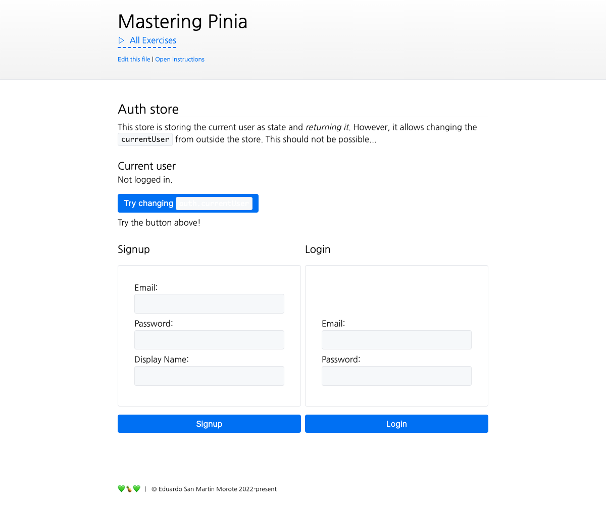

# Private state in Stores

<picture>
  <source srcset="./.internal/screenshot-dark.png" media="(prefers-color-scheme: dark)">
  
</picture>

Let's practice hiding state from a store to avoid it being changed by accident.

## 📝 Your Notes

Write your notes or questions here.

## 🎯 Goals

Let's first practice what we just watched by adding a private state to a store. The store is already created in
`stores/auth.ts`.

- Ensure the store's `currentUser` is defined as _private state_, like we saw in the lesson
- Expose the `currentUser` as a getter in the auth store so it can be used in the template
