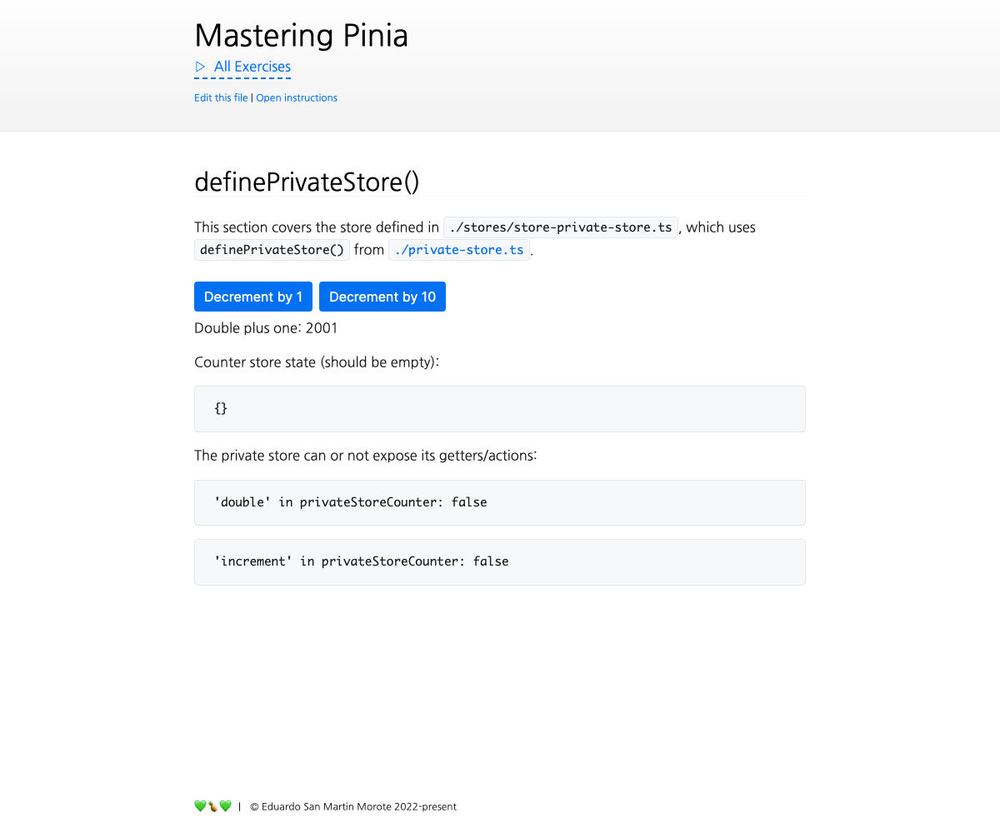

# Internal Stores

<picture>
  <source srcset="./.internal/screenshot-dark.png" media="(prefers-color-scheme: dark)">
  
</picture>

**Note**: Make sure to finish the previous exercises before working on this one.

Let's create a custom `definePrivateStore()` that creates an internal store to have any _private_ properties.

## 📝 Your Notes

Write your notes or questions here.

## 🎯 Goals

**Note**: the same tips regarding TypeScript seen in the previous exercise apply here.

The work will happen **only** in `private-store.ts`. The other file are just meant to be there to help you understand
what we are trying to achieve and to test out things in the browser.

- Let's do a more advanced version than the _definePrivateState()_: In `private-store.ts`, implement
  `definePrivateStore()` so it can be used in `stores/store-private-store.ts` like this:

  ```ts
  export const usePrivateCounter = definePrivateStore(
    'my-id',
    // a function that defines a private store
    () => {
      const n = ref(0)

      function increment(amount = 1) {
        privateStore.n += amount
      }

      return { n, increment }
    }
    // this is a setup store **with an argument**
    // it should give access to the private state defined above
    privateStore => {
      const double = computed(() => privateStore.n * 2)

      return {
        double,
        // we can decide to expose increment if we want to
        increment: privateStore.increment,
      }
    },
  )
  ```

  - Use the 2nd argument `privateStoreSetup` to _define a store_ that holds private state **and any private getters or
    actions**.
  - Define another store that will be the **public store** that will be returned by `definePrivateStore()`.
  - This version of the store should be fairly similar to the one we just did, **it mostly differs in Types**.

  <details>
  <summary>💡  Tip: <i>Pinia type Helpers</i></summary>

  Pinia exposes some type helpers to work with Store types. In this scenario, we need a way to extract the type of a
  _Store instance_ from the `privateStoreSetup` function. We can use `SetupStoreDefinition` for that:

  ```ts
  import { SetupStoreDefinition, defineStore } from 'pinia'

  export function definePrivateStore<
    Id extends string,
    // 👇 no extends constraint this time, like with StoreSetup
    PrivateStore,
    StoreSetup,
  >(
    id: Id,
    // 👇 same as before
    privateStoreSetup: () => PrivateStore,
    setup: (
      // 👇 We need to get a bit more complex here
      privateState: ReturnType<SetupStoreDefinition<string, PrivateStore>>,
    ) => StoreSetup,
  ) {
    // ...
  }
  ```

  </details>
