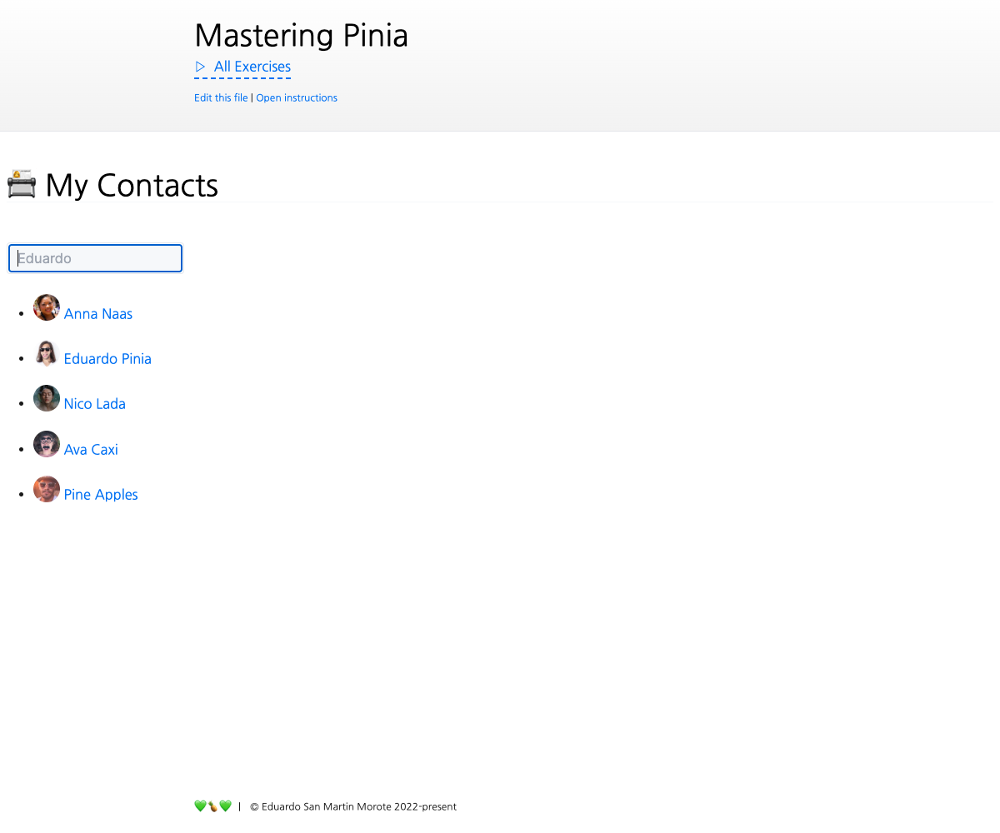

# Data fetching

<picture>
  <source srcset="./.internal/screenshot-dark.png" media="(prefers-color-scheme: dark)">
  
</picture>

In this exercise we will create a custom a mini data fetching solution to learn how to combine stores with regular
composables and how **not** to put everything in a store!

We will be implementing a simplified and limited version of [Pinia Colada](https://github.com/posva/pinia-colada).

<a href="https://github.com/posva/pinia-colada">
  
</a>

⚠️ This exercise is split in two parts because it can be very long. Don't overdue yourself, it's recommended to solve
this exercise over the span of multiple days.

## 📝 Your Notes

Write your notes or questions here.

## 🎯 Goals

This exercise is very long and there are many ways to implement the same functionality. I will give you some steps to
follow but feel free to do it your own way. During the correction, I will follow the steps below. The main goal of the
exercise is to understand the benefits of **combining a store with composables** rather than **putting everything in a
store**. While we will be adding features to `use-query.ts` and `use-mutation.ts`, we will also be writing part of the
features into the `data-fetching-store.ts` store. You will find many types to guide you through this exercise, but feel
free **to adapt them**, and create your own instead. For example, you can adapt the _interface_
` UseDataFetchingQueryEntry<TResult = unknown, TError = any>` to your needs. Note that you can't change the public API
of the entry or `useQuery()` and `useMutation()` (`data`, `error`, `isFetching`, `refetch()`, `refresh()`) as those are
used by the tests to check your solution.

```vue
<script lang="ts" setup>
import ContactCard from '../../ContactCard.vue'
import { getContactById, updateContact as _updateContact } from '@/api/contacts'
import { useRoute } from 'vue-router/auto'
import { useQuery } from '../../use-query'
import { useMutation } from '../../use-mutation'

const route = useRoute('/6.8-advanced-data-fetching//[id]')

// automatically fetches the contact based on the route
const { data: contact } = useQuery({
  key: () => 'contacts/' + route.params.id,
  query: () => getContactById(route.params.id),
})

// automatically invalidates the cache when the mutation resolves
// for both "contacts" (the list on the left) and "contacts/:id" (the contact currently displayed)
const { mutate: updateContact } = useMutation({
  keys: ['contacts', ({ variables: [{ id }] }) => 'contacts/' + id],
  mutation: _updateContact,
})
</script>

<template>
  <section class="pt-6">
    <ContactCard v-if="contact" :key="contact.id" :contact="contact" @update:contact="updateContact" />
  </section>
</template>
```

### Part one: Querying

The first step is to implement `useQuery()`. The goal of this composable is to provide a way to fetch data and keep it
cached for a configurable period of time. It should expose the promise state (loading, error) and a way to manually
refetch (ignores cache) and refresh (reuses cache if fresh) the data. It will also deduplicate requests whenever
possible to avoid running the same query multiple times in parallel. The feature itself isn't an easy task but on top of
making it work, I ask you to also think about how to split the logic between the store and the composable. Needless to
say, this also means **you will be writing code in both, `use-query.ts` and `data-fetching-store.ts`**. There is no
_right_ way to do it so try to pass as many tests as possible while finding an API that you like 😄.

- Start by adding `data` to the returned object of `useQuery()`
  - Implement the store action `ensureEntry()`
  - I recommend you to implement the `refetch()` method first.
  - `refetch()` should **not** create a new request if there is already a pending one
  - Ensure `useQuery()` uses the correct entry based on the `key` option, **especially with refs and getters**
  - Ensure `data` is updated **only** when the query resolves. That way we can still display the old value while it's
    loading
- Add the `isFetching` property
  - Ensure it is `true` when the query is running and `false` otherwise
- Add the `error` property
  - Ensure it is updated when the query rejects or resolves
- Implement `refresh()`
  - Deduplicate requests
  - Only fetches if the `cacheTime` has expired (use `isExpired()`)

### Part two: Mutating

This part is similar to `useQuery()`. The main point of having a `useMutation()` is to automatically invalidate the
cache and fetch it again to keep an always up-to-date UI ✨. Like queries, mutations should also handle the async state
(loading, error). There is no need to deduplicate requests as mutations are always manually triggered.

- Handle `isFetching` state
  - Should be `true` when the mutation is running and `false` otherwise
- Handle `data`
  - Should be updated when the mutation resolves
- Handle `error`
  - Should be updated when the mutation rejects or resolves
- Invalidating cached queries based on the `keys` option when the mutation settles
- Ensure that new calls to `mutate()` take precedence over the previous ones
  - The old mutation result should be ignored

## 💪 Extra goals

_Extra goals might not have any tests and can be done later or skipped._

- Connect the search text to the URL with a query string named `search`, e.g. `?search=Anna`
- Replace `useFuse()` with a `useQuery()` that keeps track of the search argument for the cache
