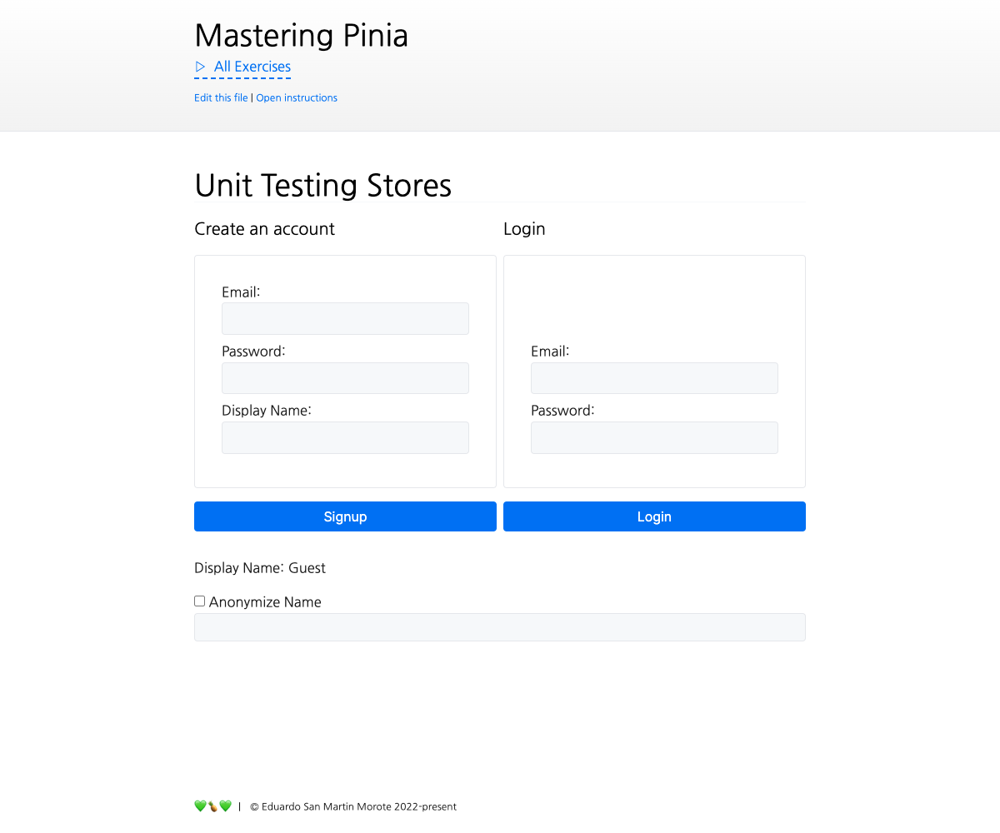

# Testing Stores

<picture>
  <source srcset="./.internal/screenshot-dark.png" media="(prefers-color-scheme: dark)">
  
</picture>

In this exercise we will unit test a store. We will cover mocking requests with msw, testing the store's behavior,
adding Pinia plugins in tests, and mocking timers.

‼️ Open the Vitest UI and
[select the `8.4-testing-stores` exercise](http://localhost:51205/__vitest__/#/?file=-580791252). This will allow you to
run the tests and see the results.

⚠️ WARNING: we are using [Mock Service Worker v1](https://v1.mswjs.io/) to mock requests. The v2 was released after
Mastering Pinia and it hasn't been updated to avoid breaking the exercises. There are some differences between the two
versions, so be careful when looking for documentation.

## 📝 Your Notes

Write your notes or questions here.

## 🎯 Goals

This exercise is a little bit different because we will be writing our own tests. **There is no automated test to check
your solution**. The file `store/auth.spec.ts` is included in
[the already running tests](http://localhost:51205/__vitest__/#/?file=-580791252). You will need to remove the `.todo`
on `it.todo('...')` to ensure the test runs.

- Setup pinia in the tests
- Test that `store.displayName` returns the user's name
- Test that `store.displayName` returns "Guest" if there is no user
- Test that `store.displayName` returns "Anonymous" if the `preferencesStore.anonymizeName` is `true`
- Test that the `logout()` action clears the `store.user`
- Test that the `login()` action sets the `store.user` with the returned user by the API (this must work without a
  running API server)
- Test that the stores automatically logs in the user if a Cookie named `mp_user` is found.
- Make the last test pass by properly adding the _PiniaDebounce_ Pinia plugin, mocking the timers and mounting a
  component
