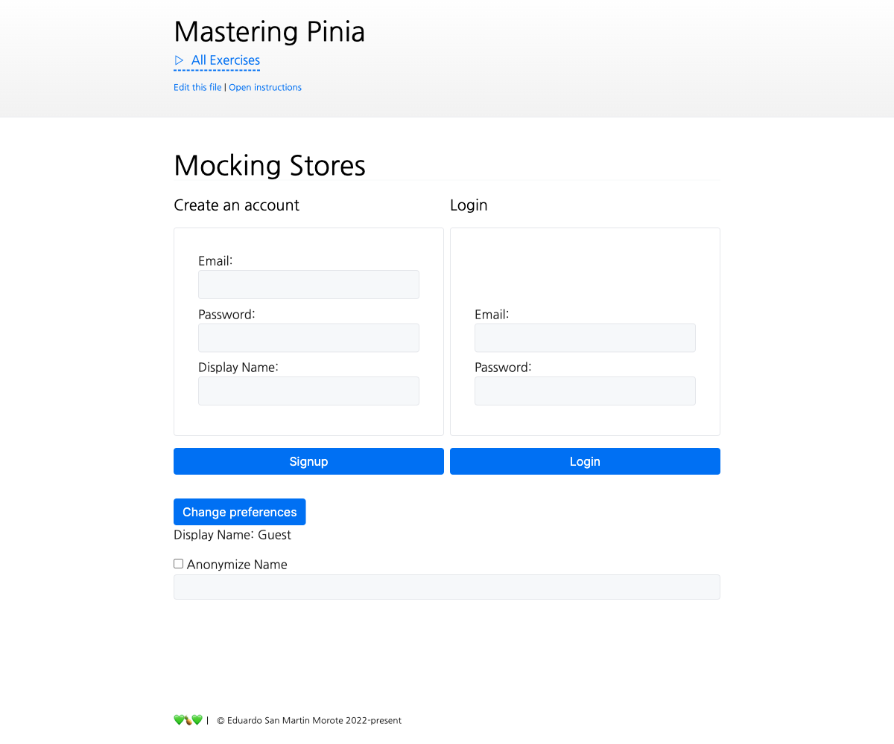

# Mocking Stores

<picture>
  <source srcset="./.internal/screenshot-dark.png" media="(prefers-color-scheme: dark)">
  
</picture>

In this exercise we will unit test a component that uses a store. We will cover mocking the store with the testing pinia
and mock some requests like in the previous exercise.

‼️ Open the Vitest UI and
[select the `8.6-testing-stores` exercise](http://localhost:51205/__vitest__/#/?file=-593802058). This will allow you to
run the tests and see the results.

⚠️ WARNING: we are using [Mock Service Worker v1](https://v1.mswjs.io/) to mock requests. The v2 was released after
Mastering Pinia and it hasn't been updated to avoid breaking the exercises. There are some differences between the two
versions, so be careful when looking for documentation.

## 📝 Your Notes

Write your notes or questions here.

## 🎯 Goals

Like the previous exercise, this exercise is a little bit different because we will be writing our own tests. **There is
no automated test to check your solution**. The file `mocking-stores.spec.ts` is included in
[the already running tests](http://localhost:51205/__vitest__/#/?file=-593802058). _It could have been named
`index.spec.ts` but it's just too generic and easy to miss with other `index.vue` files._

- Change the first test to use a Testing Pinia and make it pass
- Test that the `auth.register` action is called with whatever is filled in the form
- Overwrite the `displayName` getter to match `Faked` and pass the test
- Test that the login works while mocking the request and **without stubbin the actions**. _You will need
  `await delay(0)` or fake timers_
- Test that clicking on `[data-test=update-preferences]` calls both `auth.updateLocalPreferences` and
  `preferences.saveServerPreferences` without actually executing `preferences.saveServerPreferences` (it throws and will
  break the test)
- Write a similar test that checks the `preferences.saveServerPreferences` is not called if the user is not logged in
- Refactor the mounting of the component into one single function that accepts arguments to overwrite the testing pinia
  options and use it in every test

  ```ts
  import type { TestingOptions } from '@pinia/testing'
  function factory(options: TestingOptions = {}) {
    // ...
  }
  ```

## 💪 Extra goals

_Extra goals might not have any tests and can be done later or skipped._

- Extend the `mockedStore()` to allow overwriting a getter
